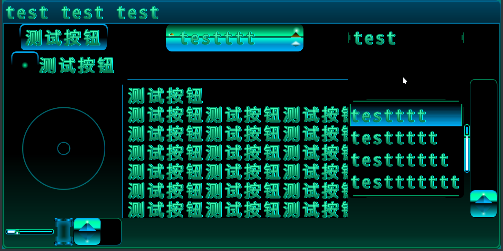
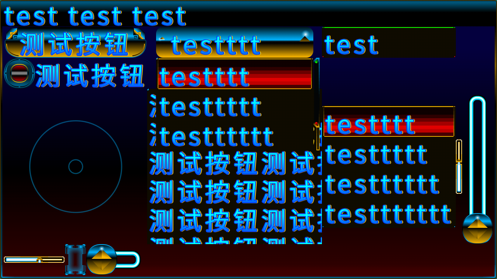

# fantastic-plastic-libgdx-skin
Skin for LibGDX gui.  
Mobile oriented. Interactive elements sizes close to 80 px wide.  
## FOSS - Free Open Source Software licensing  

### fap80  
  

### fap  

## Where is:  
- `demo` - libgdx **Kotlin** project `KDA` for demonstration of fantastic plastic skin(`fap`)  
- `font-with-effects.hiero` - Hiero libgdx tool settings for personal font (screenshot above).
- `fap.tpproj` - gdx-texturepacker.jar project linked to `png` folder  
- `svg` - source image files created uses **inkscape**

## Usage:  
- 0 - clone this repository or download folders separetely  
- 1 - copy `gui` folder from `demo/KDA/core/src` into your project `core/src` folder  
- 2 - copy `bmfonts` , `raw` and `skin` folders from `demo/KDA/android/assets` folders to your project `assets` folder  
- 3 - inside code:  
`import gui.FantasticPlasticSkin as Fap`   
...  
`internal val uiskin:Fap = Fap()`  
...  
`uiskin.prepare()`  

Now you can use `uiskin` usual way. Default libgdx skin included inside `Fap()` instance.

## Styled widget's list.

[ScrollPane](https://libgdx.badlogicgames.com/ci/nightlies/docs/api/com/badlogic/gdx/scenes/scene2d/ui/ScrollPane.ScrollPaneStyle.html)
[SplitPane](https://libgdx.badlogicgames.com/ci/nightlies/docs/api/com/badlogic/gdx/scenes/scene2d/ui/SplitPane.SplitPaneStyle.html)
[Tree](https://libgdx.badlogicgames.com/ci/nightlies/docs/api/com/badlogic/gdx/scenes/scene2d/ui/Tree.TreeStyle.html)
[Label](https://libgdx.badlogicgames.com/ci/nightlies/docs/api/com/badlogic/gdx/scenes/scene2d/ui/Label.LabelStyle.html)
[Button](https://libgdx.badlogicgames.com/ci/nightlies/docs/api/com/badlogic/gdx/scenes/scene2d/ui/Button.ButtonStyle.html)
[TextButton](https://libgdx.badlogicgames.com/ci/nightlies/docs/api/com/badlogic/gdx/scenes/scene2d/ui/TextButton.TextButtonStyle.html)
[CheckBox](https://libgdx.badlogicgames.com/ci/nightlies/docs/api/com/badlogic/gdx/scenes/scene2d/ui/CheckBox.CheckBoxStyle.html)
[TextField](https://libgdx.badlogicgames.com/ci/nightlies/docs/api/com/badlogic/gdx/scenes/scene2d/ui/TextField.TextFieldStyle.html)
[TextArea](https://libgdx.badlogicgames.com/ci/nightlies/docs/api/com/badlogic/gdx/scenes/scene2d/ui/TextField.TextFieldStyle.html)
[List](https://libgdx.badlogicgames.com/ci/nightlies/docs/api/com/badlogic/gdx/scenes/scene2d/ui/List.ListStyle.html)
[SelectBox](https://libgdx.badlogicgames.com/ci/nightlies/docs/api/com/badlogic/gdx/scenes/scene2d/ui/SelectBox.SelectBoxStyle.html)
[ProgressBar](https://libgdx.badlogicgames.com/ci/nightlies/docs/api/com/badlogic/gdx/scenes/scene2d/ui/ProgressBar.ProgressBarStyle.html)
[Slider](https://libgdx.badlogicgames.com/ci/nightlies/docs/api/com/badlogic/gdx/scenes/scene2d/ui/Slider.SliderStyle.html)
[Window](https://libgdx.badlogicgames.com/ci/nightlies/docs/api/com/badlogic/gdx/scenes/scene2d/ui/Window.WindowStyle.html)
[Touchpad](https://libgdx.badlogicgames.com/ci/nightlies/docs/api/com/badlogic/gdx/scenes/scene2d/ui/Touchpad.TouchpadStyle.html)
[Dialog](https://libgdx.badlogicgames.com/ci/nightlies/docs/api/com/badlogic/gdx/scenes/scene2d/ui/Window.WindowStyle.html)

## Problems with testing:

2018-12-09
Scene2d.ui. ...
TextArea() - crush often, with bug , looks similar as official bug
